#  AWS Auto-Scaling with Lambda Based on ALB Network Load

This project demonstrates how to automatically **scale EC2 instances** based on network load using AWS **Application Load Balancer (ALB)**, **CloudWatch**, **Lambda**, **SNS**, and **EventBridge**.

---

##  Project Overview

- Monitor ALB `RequestCount` metric using Lambda every 5 minutes
- Auto-launch EC2 instance if traffic > HIGH threshold
- Auto-terminate EC2 instance if traffic < LOW threshold
- Notifications sent via Amazon SNS
- Load tested using Apache Benchmark (ab)

---

##  AWS Services Used

| Service      | Purpose                                      |
|--------------|----------------------------------------------|
| EC2          | Hosts web application (Apache)               |
| ALB          | Balances network traffic                     |
| CloudWatch   | Monitors `RequestCount` metric               |
| Lambda       | Serverless auto-scaling logic                |
| SNS          | Sends notifications on scale events          |
| IAM          | Permissions for Lambda to access resources   |
| EventBridge  | Triggers Lambda every 5 minutes              |

---

## Architecture Diagram

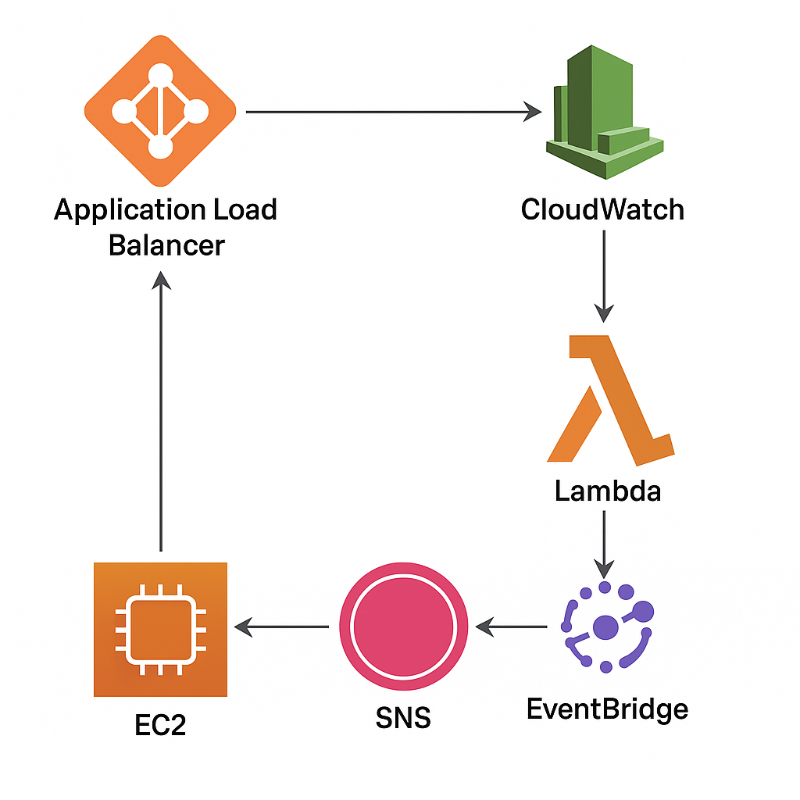

---

## 🖼️ Screenshots

| Description                       | Screenshot                          |
|----------------------------------|--------------------------------------|
| SNS Topic + Subscription         | 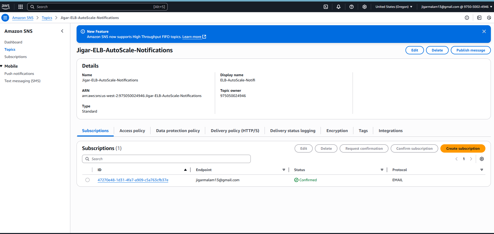 |
| IAM Role + Policies              | 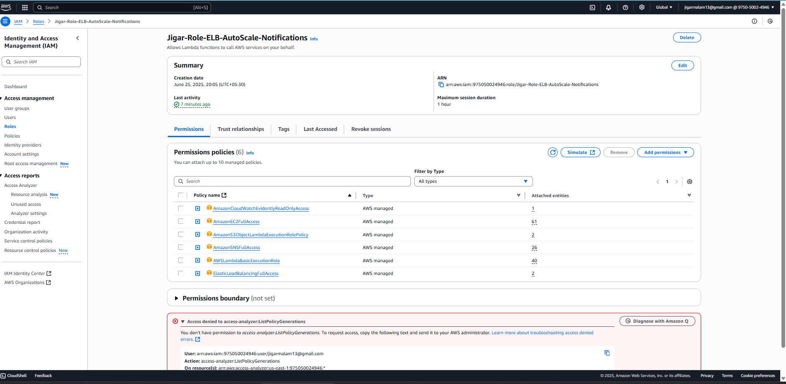 |
| Lambda Function Code             | 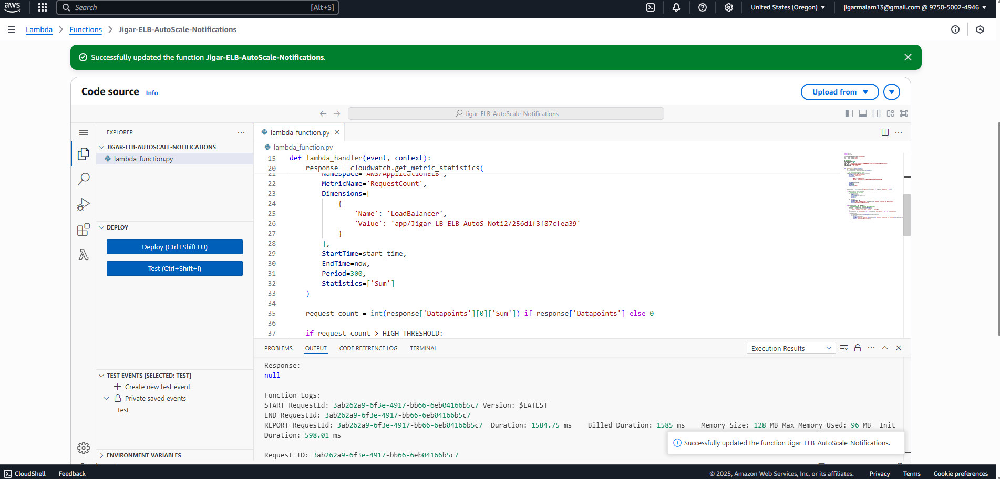 |
| RequestCount Metric in CloudWatch| 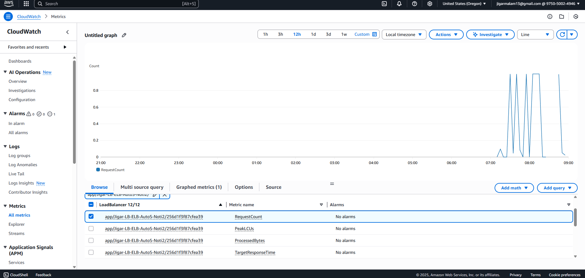 |
| Lambda Execution Logs            | 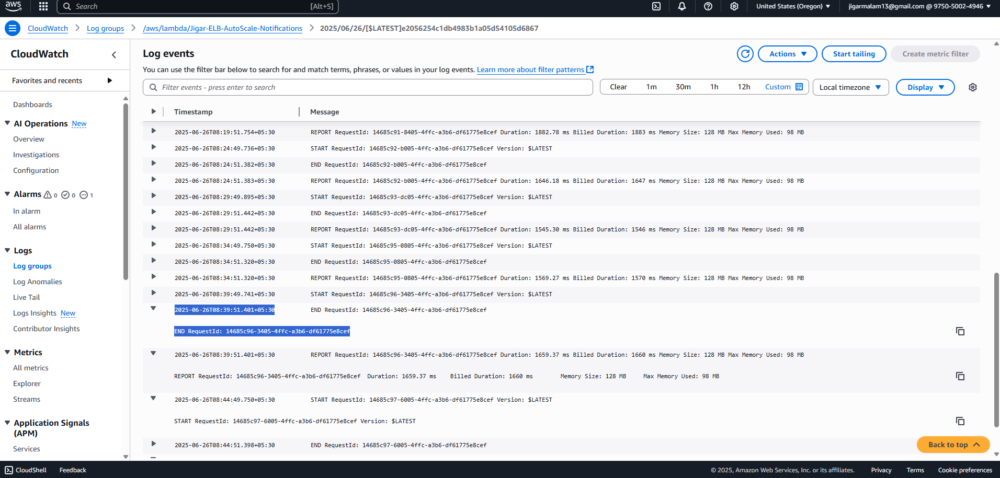 |
| Registered EC2 in ALB Target Group| 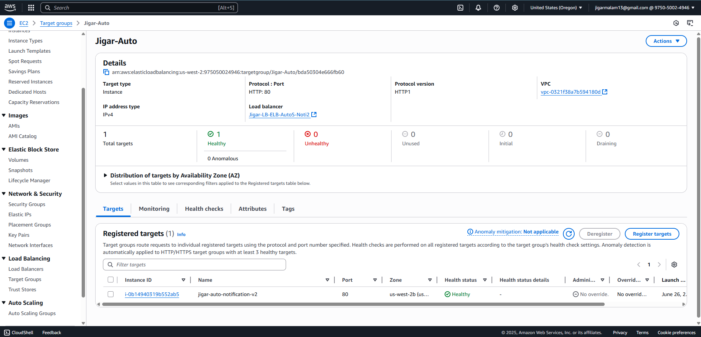 |
| EC2 Instances Dashboard          | 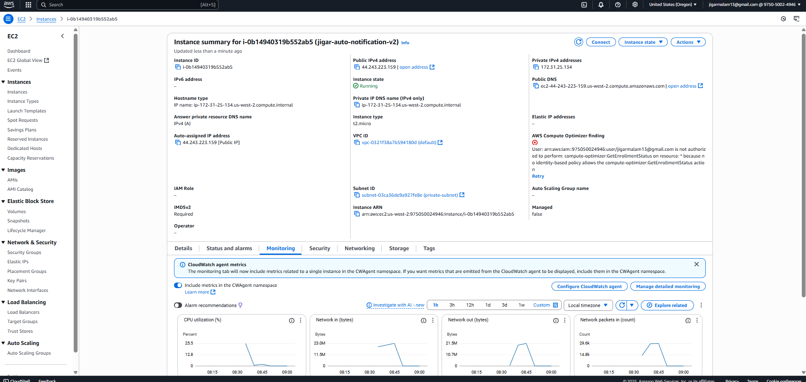 |
| SNS Email Notification           | 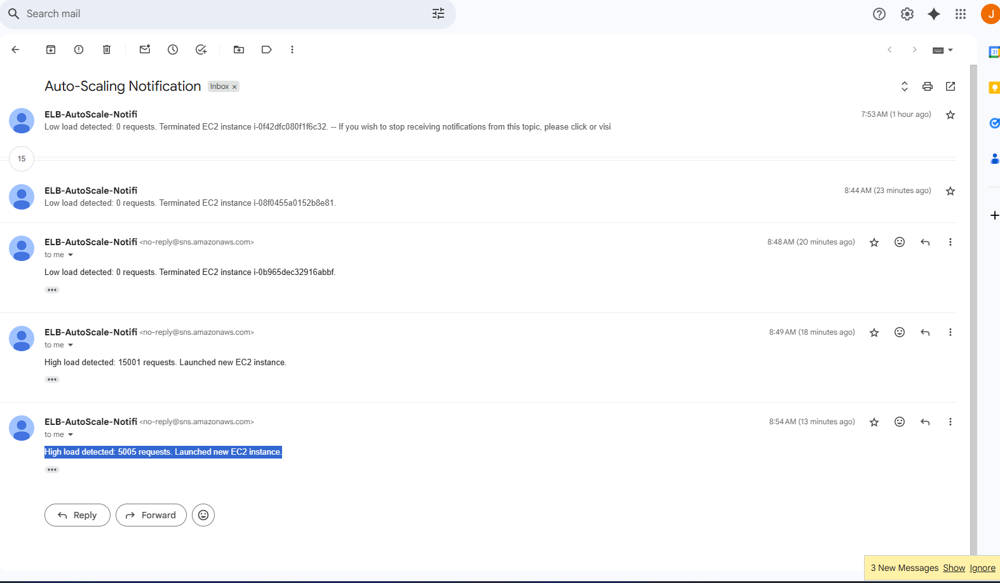 |
| Apache Benchmark Load Test       | 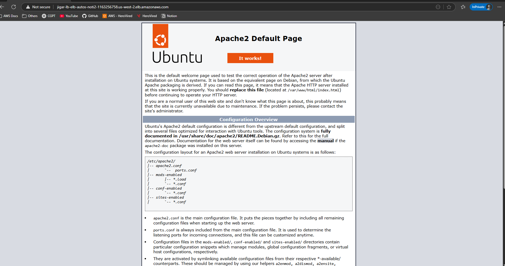 |
| EventBridge Trigger              | 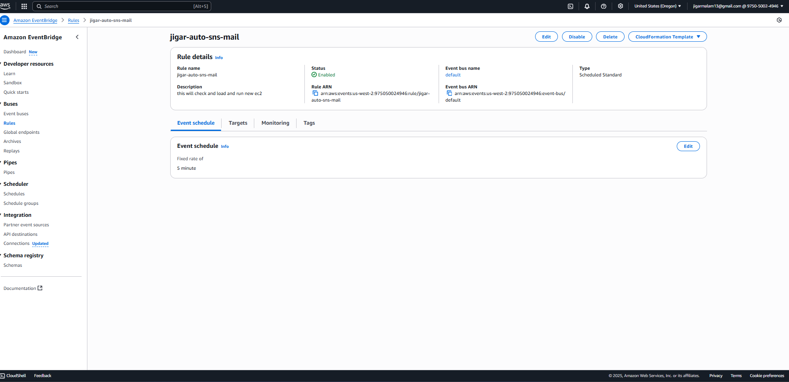 |

---

## 📂 File Structure

